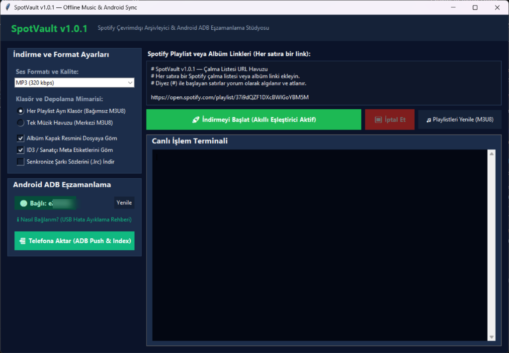

<div align="center">
  <h1>🎵 SpotVault</h1>
  <p><strong>Spotify Çalma Listesi Arşivleme · Yerel Müzik Kütüphanesi · Android Senkronizasyonu</strong></p>
  
  [](LICENSE)
  [](#-desteklenen-platformlar)
  [](#-gereksinimler)

  [English](README.md) · [Türkçe](README.tr.md)

  
</div>

## 📌 Genel Bakış

SpotVault, Spotify çalma listesi ve albüm bağlantılarından yerel bir müzik arşivi oluşturmak için geliştirilen açık kaynaklı bir masaüstü aracıdır. Grafik arayüzü (GUI) ve komut satırı iş akışlarını bir araya getirerek; akıllı parça eşleştirme, yerel dosya kontrolü, M3U8 çalma listesi oluşturma ve ADB üzerinden doğrudan Android USB aktarımı sağlar.

SpotVault, parçaları bulmak için harici ses kaynaklarını kullanır. **Spotify hesabı gerektirmez, Spotify'ın orijinal ses akışını indirmez ve DRM korumasını aşmaz.** Yalnızca herkese açık Spotify bağlantılarıyla (public URL) çalışır.

## ⚡ Temel Özellikler

- **GUI ve CLI İş Akışları**: Modern masaüstü arayüzünü (Türkçe & İngilizce destekli) kullanın veya işlemleri terminal üzerinden arka planda çalıştırın.
- **Dirençli Parça Eşleştirme**: Spotify metadata verilerini harici kaynak sonuçlarıyla, ayarlanabilir süre toleransları ve beyaz listeler (`custom_labels.txt`) üzerinden eşleştirir.
- **Artımlı Arşivleme**: Zaten indirilmiş olan dosyaları atlayarak bant genişliğinden ve zamandan tasarruf sağlar.
- **Otomatik M3U8 Üretimi**: Modern müzik çalarlarla tam uyumlu çalma listesi dosyaları oluşturur.
- **Doğrudan Android Senkronizasyonu**: Yerel arşivinizi ADB (Android Debug Bridge) aracılığıyla doğrudan telefonunuza kopyalar ve depolama alanı kontrollerini otomatik yapar.

## 🎵 Ses Formatları ve Şeffaflık

SpotVault, sesi desteklenen harici kaynaklardan çekmek için alt yapı araçlarını (spotDL vb.) kullanır.

- **M4A / Kaynak Formatı**: Mümkün olduğunda kaynağın orijinal formatını korumak, ek bir kayıplı (lossy) dönüştürme adımını engeller.
- **MP3 (320 kbps hedefi)**: Eski cihazlarla uyumluluk için MP3 dönüştürmesi yapılabilir. Ancak daha yüksek bir bit hızına dönüştürmek, kaynak dosyada bulunmayan ses kalitesini sihirli bir şekilde geri kazandırmaz.

*Not: Otomatik eşleştirme sistemleri zaman zaman yanlış sürümü (stüdyo kaydı yerine canlı performans vb.) seçebilir. İşlem sonrası arşivinizi kontrol etmeniz önerilir.*

## 🚀 Hızlı Başlangıç

### Windows
1. Depoyu indirin veya klonlayın.
2. `start.bat` dosyasını çalıştırın. (Gerekli Python sanal ortamını ve bağımlılıkları otomatik kuracaktır).
3. Açılan uygulamaya herkese açık bir Spotify bağlantısı yapıştırın.
4. **İndirmeyi Başlat**'a tıklayın.

### Linux
```bash
git clone https://github.com/panehesy/spotvault.git
cd spotvault
chmod +x start.sh
./start.sh
```
*Dağıtımınıza bağlı olarak, başlatıcı betik bazı paketleri bulamazsa manuel kurulum yapmanız gerekebilir (ör. `sudo apt install python3 python3-tk ffmpeg adb`).*

### Manuel Kurulum (Gelişmiş)
Başlatıcı betikleri kullanmak istemiyorsanız:
```bash
python -m venv .venv
# Sanal ortamı aktif edin (Windows için: .venv\Scripts\activate, Linux için: source .venv/bin/activate)
pip install -r requirements.txt
python spotvault.py --help
```

## 📱 Android ADB Kurulumu

Android USB aktarım özelliğini kullanmak için:
1. Android cihazınızda **Geliştirici Seçenekleri**'ni etkinleştirin.
2. **USB hata ayıklama (USB debugging)** seçeneğini açın.
3. Cihazı bilgisayarınıza bağlayın.
4. Telefon ekranında çıkan **"USB hata ayıklamaya izin verilsin mi?"** uyarısını onaylayın.

Eğer aktarım başarısız olursa veya cihaz loglarda `unauthorized` (yetkisiz) olarak görünürse; telefonunuzun kilidini açın, kabloyu çıkarıp tekrar takın ve ekrandaki yetki onayı penceresini kabul edin.

## 🏗️ Mimari: Ham CLI Araçları vs. SpotVault Ekosistemi

spotDL gibi CLI araçları ham indirme sürecini yönetirken, SpotVault bu araçların etrafına örülmüş **bütünleşik bir arşivleme ekosistemi** sunar:

- **Durum Yönetimi**: Nelerin indirildiğini bilir, ortak bir müzik havuzu veya çalma listesine özel klasörler oluşturur.
- **Çalma Listesi Üretimi**: Android cihazlar için yolları göreceli (relative) olarak ayarlanmış, UTF-8 M3U8 dosyalarını otomatik inşa eder.
- **Cihaz Senkronizasyonu**: Yavaş MTP sürükle-bırak işlemlerini ortadan kaldırır. ADB üzerinden hızlı dosya kopyalama ve MediaScanner tetiklemelerini otomatik yapar.
- **Görsel Arayüz**: Terminal komutları yerine modern, çift dilli bir masaüstü arayüzü sunar.

### Proje Yapısı
```text
spotvault/
├── core/
│   ├── config.py             # Ayarlar ve yapılandırma
│   ├── matcher.py            # Akıllı eşleştirme ve filtreler
│   ├── downloader.py         # Alt süreç yönetimi ve atlama mantığı
│   ├── playlist_generator.py # M3U8 üretim motoru
│   ├── i18n.py               # Çeviri motoru (TR/EN)
│   └── adb_sync.py           # ADB cihaz keşfi ve dosya aktarımı
├── gui/
│   ├── app.py                # Tkinter masaüstü arayüzü
│   └── theme.py              # Arayüz tema yönetimi
├── tests/                    # 57 Otomatik Birim ve Entegrasyon Testi
├── docs/                     # Görsel varlıklar
├── spotvault.py              # Ana CLI ve GUI giriş noktası
└── start.bat / start.sh      # Otomatik ortam kurulum betikleri
```

## 🛠️ Sorun Giderme

- **Uygulama açılmıyor**: Hata çıktılarını görmek için terminalden `python spotvault.py` komutunu çalıştırın. Python 3.10 veya üzerinin kurulu olduğundan emin olun.
- **Ses dönüşümü başarısız**: Sisteminizde `ffmpeg` aracının kurulu ve PATH değişkenine ekli olduğundan emin olun.
- **Eksik veya yanlış eşleşen parçalar**: Eşleşme toleranslarını veya `custom_labels.txt` yapılandırmasını kontrol edin.

## 📜 Lisans ve Yasal Uyarı

SpotVault bağımsız bir açık kaynak projesidir; Spotify, Google veya YouTube ile bağlantılı veya yetkili değildir. DRM korumasını aşmaz ve korumalı ses akışlarını deşifre etmez. Kullanıcılar geçerli telif hakkı yasalarına uymakla yükümlüdür.

Proje [MIT Lisansı](LICENSE) altında dağıtılmaktadır.
